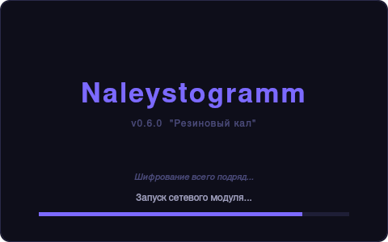
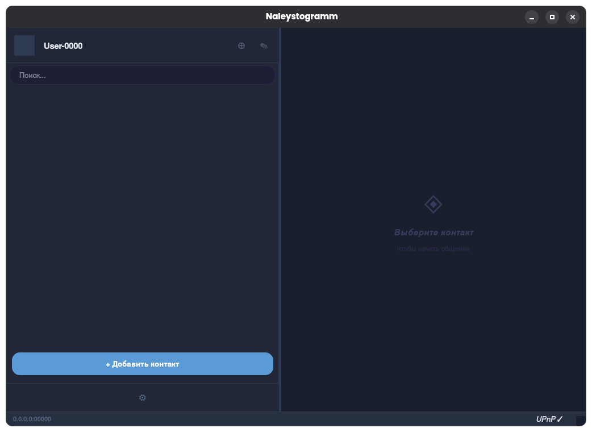
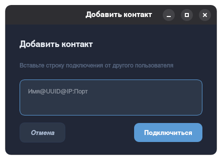
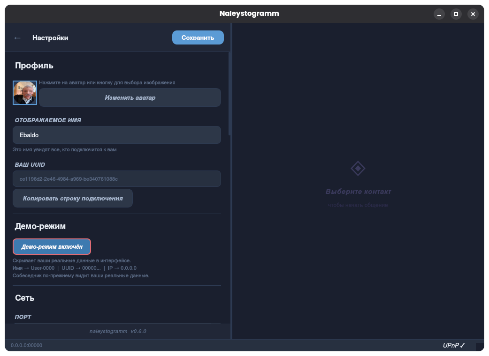
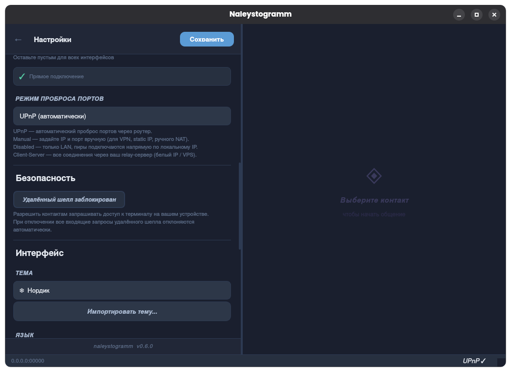
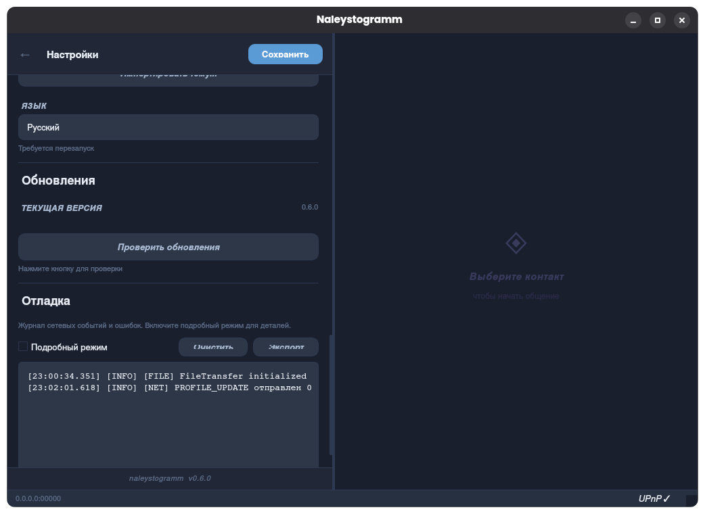

<div align="center">

# Naleystogramm

**Зашифрованный P2P-мессенджер без серверов и слежки**

[](https://github.com/Xomel45/naleystogramm/releases)
[](#установка)
[](https://www.qt.io/)
[](LICENSE)

</div>

---

## О проекте

Naleystogramm — десктопный мессенджер с прямым зашифрованным соединением между пользователями. Никаких центральных серверов, никакой регистрации, никакого хранения переписки на чужих машинах.

Соединение устанавливается напрямую по TCP — как в старые добрые времена ICQ, только всё зашифровано Double Ratchet + AES-256-GCM.

---

## Скриншоты

<div align="center">

### Сплеш-экран


### Главное окно


### Добавление контакта


### Настройки — Профиль


### Настройки — Безопасность и интерфейс


### Настройки — Язык и отладка


</div>

---

## Возможности

### Сообщения и файлы
- Текстовые сообщения с E2E-шифрованием (Double Ratchet)
- Передача файлов с паузой/возобновлением (AES-256-GCM)
- Голосовые сообщения (WAV PCM 16-bit 16 кГц)
- Индикаторы онлайн/оффлайн в реальном времени

### Голосовые звонки
- VoIP на базе Opus (32 кбит/с, DTX)
- Jitter-буфер с Opus PLC при потере пакетов
- Зашифрованные медиапотоки (AES-256-GCM по UDP)

### Сеть
- Прямое P2P-соединение (TCP)
- UPnP для автоматического пробоса портов
- Ручная настройка IP/порта (для VPN, статических адресов)
- Режим ретрансляции через собственный relay-сервер
- Автоматическое переподключение с keepalive PING/PONG

### Безопасность
- End-to-end шифрование на каждое сообщение (Double Ratchet)
- Шифрование базы данных (SQLCipher, опционально)
- Удалённый шелл с защитой от эскалации привилегий
- Верификация собеседника по Safety Number

### Интерфейс
- 7 встроенных тем + поддержка пользовательских тем (zip/tar.gz/7z)
- Русский и английский языки
- Демо-режим (скрывает реальные данные в UI)
- Проверка обновлений через GitHub Releases

---

## Установка

### Linux

Скачай AppImage из [Releases](https://github.com/Xomel45/naleystogramm/releases), дай права на запуск и запусти:

```bash
chmod +x Naleystogramm-0.6.0-x86_64.AppImage
./Naleystogramm-0.6.0-x86_64.AppImage
```

### Windows

Скачай архив из [Releases](https://github.com/Xomel45/naleystogramm/releases), распакуй и запусти `naleystogramm.exe`.

> При первом запуске Windows попросит права администратора — это нужно для открытия порта в брандмауэре.

---

## Как подключиться к кому-то

1. Запусти приложение
2. В главном окне нажми **«+ Добавить контакт»**
3. Вставь строку подключения собеседника в формате `Имя@UUID@IP:Порт`
4. Строку подключения собеседник находит в своих настройках → **«Скопировать строку подключения»**

---

## Сборка из исходников

### Зависимости (Linux)

```bash
# Arch / Manjaro
sudo pacman -S qt6-base qt6-multimedia opus openssl cmake

# Ubuntu / Debian
sudo apt install qt6-base-dev qt6-multimedia-dev libopus-dev libssl-dev cmake
```

### Linux

```bash
cmake -B build-linux -DCMAKE_BUILD_TYPE=Release
cmake --build build-linux --target naleystogramm -j$(nproc)
```

### Windows (кросс-компиляция с Linux через MinGW-w64)

```bash
cmake -B build-win -DCMAKE_TOOLCHAIN_FILE=cmake/toolchain-mingw64.cmake
cmake --build build-win -j$(nproc)
```

### Релиз (AppImage + Windows пакет)

```bash
./deploy.sh release --build --clean
# Артефакты: builds/releases/0.6.0-linux/ и builds/releases/0.6.0-windows/
```

---

## Технологии

| | |
|---|---|
| **UI** | Qt 6, QSS темы |
| **Шифрование** | OpenSSL — AES-256-GCM, Double Ratchet, X25519 ECDH |
| **Голос** | Opus, Qt6Multimedia |
| **База данных** | SQLite / SQLCipher |
| **Сеть** | TCP (JSON-фреймы), UDP (медиа) |
| **Сборка** | CMake 3.22+, кросс-компиляция MinGW-w64 |

---

## Структура проекта

```
src/
├── core/         — сетевой стек, E2E, хранилище, сессия
├── media/        — медиадвижок (Opus, UDP)
├── ui/           — виджеты, темы, диалоги
└── main.cpp
assets/           — скриншоты для README
cmake/            — тулчейн MinGW-w64
scripts/          — make_appimage.sh
translations/     — .ts/.qm файлы локализации
deploy.sh         — скрипт сборки релизов
```

---

<div align="center">

*v0.6.0 «Резиновый кал»*

</div>
